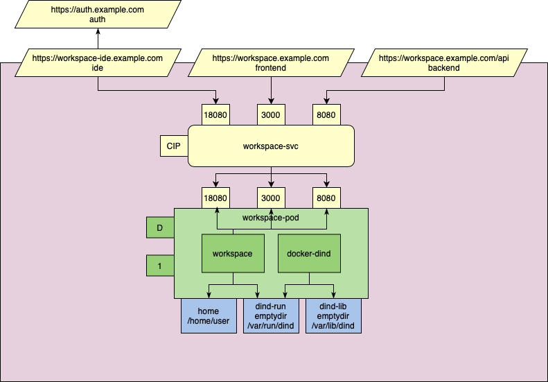

# kodadok

Kodadok is one possible deployment description that allows you to run a web based code editor, such as [code-server](https://github.com/cdr/code-server) or [theia](https://github.com/eclipse-theia/theia), on a kubernetes cluster.

*Deployment diagram of kodadok using [Kubernetes Deployment Language](https://www.openshift.com/blog/kdl-notation-kubernetes-app-deploy)*